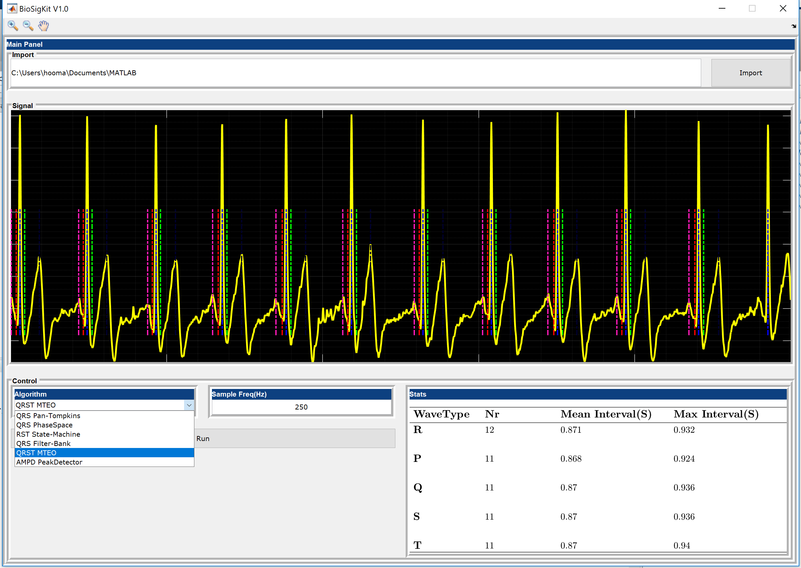

# Summary
BioSigKit is a set of Matlab (The MathWorks Inc., Natick, USA) tools for analysis and visualization of bio-signals. Matlab is a widely used programming language among researchers thanks to its simple and flexible syntax. Biomedical signal processing is one of the main areas that has been benefiting from Matlab for research and rapid prototyping. BioSigKit is a collection of signal processing tools for analysis of ECG, EEG, EMG and 3 Channel Accelerometer recordings. While there are already tools such as ECG-Kit [@Soria2015] that offer specialized algorithms for ECG processing, BioSigKit is a more general purpose biosignal analysis toolbox that allows processing various biological signals. Many of the subroutines in BioSigKit are already being actively used in research such as [@sedghamiz2014completed, @sedghamiz2013online]. BioSigKit gathers these popular signal processing algorithms under one roof. For the ECG processing, BioSigKit offers several popular algorthims that, with the exception of [@Pan1985], are only available in C language. BioSigKit offers the Matlab implementation of [@Lee2002;@Afonso1999;@Scholkmann2012] for QRS detection and analysis along with several other algorithms that are detailed in the next section. BioSigKit also provides subroutines for activity detection in EMG recordigs, posture estimation from 3 channel Accelerometers and several adaptive filtering routines as well. The object oriented implementation of BioSigKit makes it easy to update and add new algorithms to its collection. The ultimate goal of BioSigKit is to provide an easy-to-use interactive Matlab software that provides easy access to many standard bio-signal processing algorithms. 



# BioSigKit Algorithms and Use
BioSigKit provides a set of subroutines for analysis of several physiological recordings detailed below.

## ECG Analysis tools:

### 1.1. Pan and Tompkins [@Pan1985;@sedghamiz2014completed]: 
This algorithm is probably one of the most widely used algorithms for QRS detection in the research community. It combines a set of preprocessing methods in order to enhance the detection rate and reduce the false detection of T-waves in the ECG recordings (subroutine name : ```BioSigKit.PanTompkins()```).

### 1.2. Nonlinear Phase Space Reconstruction [@Lee2002]: 
This method employs the area under the non-linear phase space reconstruction of the ECG recording in order to identify the QRS complexes (subroutine name : ```BioSigKit.PhaseSpaceAlg()```). 

### 1.3. State-Machine [@sedghamiz2013online]: 
This algorithm employs state-machine in order to identify R, S and T waves in an ECG recording (subroutine name : ```BioSigKit.StateMachine()```).

### 1.4. Filter Bank [@Afonso1999]: 
The filter bank method combines several band-pass filters in order to better delineate the QRS complexes. This algorithm is very similar to wavelet based QRS detectors (subroutine name : ```BioSigKit.FilterBankQRS()```).

### 1.5. QRS Multilevel Teager Energy Operator (MTEO) [@7391510]: 
This algorithm employs Multilevel Teager Energy Operator (MTEO) in order to locate the QRS complexes. MTEO has been successfully used in Electromyography signals for action potential detection [@7391510] since it is computationally much more efficient than wavelet transform (subroutine name : ```BioSigKit.MTEO_qrstAlg()```).

### 1.6. Foetal ECG extraction [@Schreiber1996]:
Foetal-ECG extraction from multichannel and single channel maternal ECG recordings. BioSigKit implements a non-linear phase space filter that is able to extract foetal ECG recordings. This is based on delayed phase space reconstruction of the signal. For more details see [@Schreiber1996]. Futhermore, it is possible to extract the foetal ECG in real-time with the neural PCA offered in BioSigKit. See demo.m file for more details (```obj.nonlinear_phase_filt```).

### 1.7. Artifact Removal.
ECG artifact removal with Recursive Least Squares filter (RLS). BioSigKit also offers a subroutine to remove artefacts from ECG recordings by using a 3 channel Accelerometer recording with RLS filter (```obj.adaptive_filter```). BioSigKit also implements Adaptive Line Enhancer and its leaky version. For more details regarding motion artefact removal in ECG with ACC.


## General Purpose Peak Detector:
### 2.1. Automatic Multiscale-based Peak Detection [@Scholkmann2012]: 
This method is a more general peak detection. However, according to the study by Scholkmann et al. [@Scholkmann2012], it showed a high performance for the beat detection as well. Therefore, it is implemented as one of the subroutines in BioSigKit (subroutine name : ```BioSigKit.AMPD_PAlg()```).

## EMG analysis:
### 3.1. Template Matching with PsuedoCorrelation [@7391510]: 
Accurate template matching for locating MUAPs in EMG recordings based on Psuedo-Correlation (```obj.TemplateMatch```). Psuedocorrelation has shown to be more accurate than Pearson correlation.

### 3.2. Alarm and activity detection :
This subroutine employs Hilbert transform to estimate the activity levels in an EMG or audio signal recording (```obj.Env_hilbert()```).

## ECG Derived Respiration (EDR) analysis:
### 4.1. EDR Computation based on Neural PCA [@1380953]:
Computation of ECG derived respiration based on real time neural PCA computation ([@1380953]). This subroutine first applies pan-tompkins algorithm to locate the R peaks and then reconstructs the EDR signal by computing the PCs of the QRS complexes in real-time (```obj.EDR_comp```).

## Accelerometer Analysis: 
### 5.1. Posture estimation :
Posture detection and adaptive filtering in 3 Channel Accelerometer signals (```obj.ACC_Act```). This subroutine is able to compute the Energy Expenditure (EE) and Signal Magnitude Area (SMA) from 3 channel ACC recordings. Based on EE and SMA, the subroutine is able to estimate the activity level of the subject (e.g. steady, active, highly active). Accelerometers are used in many studies and being able to estimate the state of the subject by analyzing the ACC signals is helpfull in many tasks.

## EEG Processing :
### 6.1. Mobility and Activity Computation with Hjorth Parameters:
Mobility and complexity computation with Hjorth parameters in EEG signals (```obj.ComputeHjorthP```).


BioSigKit might be used either directly  from the command-line by calling its constructor (e.g. ```BioSigKit = BioSigKit(InputSignal,SamplingFrequency)```) or by initiating its GUI. However, the GUI currently only offers the subroutines for the ECG processing.

# References
